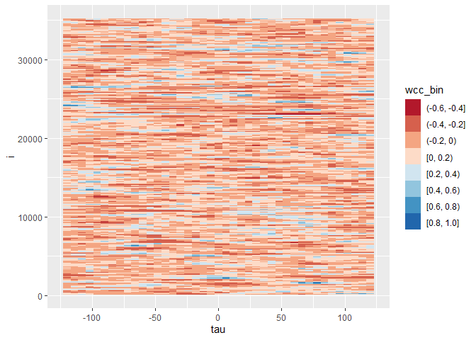

<!-- README.md is generated from README.Rmd. Please edit that file -->

# wcc

<!-- badges: start -->
<!-- badges: end -->

The goal of wcc is to provide an efficient, parallelized way of computing windowed cross-correlations in R.

## Installation

You can install the development version of wcc from
[GitHub](https://github.com/) with:

``` r
# install.packages("devtools")
devtools::install_github("jmgirard/wcc")
```

## Example

This is a basic example which shows you how to solve a common problem:

``` r
library(wcc)

# Extract the second ten minutes of interaction
second_ten <- dplyr::filter(head_velocity, time >= 10 * 60, time < 20 * 60)

# Set up parallel processing
future::plan(future::multisession)

# Conduct windowed cross-correlation analysis
res <- wcc(
  x = second_ten$x,
  y = second_ten$y,
  window_size = 4 * 60, # 4 sec windows
  window_increment = 60 / 10, # 1/10 sec increment
  lag_max = 2 * 60, # 2 sec maximum lag
  lag_increment = 60 / 10 # 1/10 sec increment
)

res$fisher_z
#> [1] 0.1402129
```

``` r
plot(res)
```


