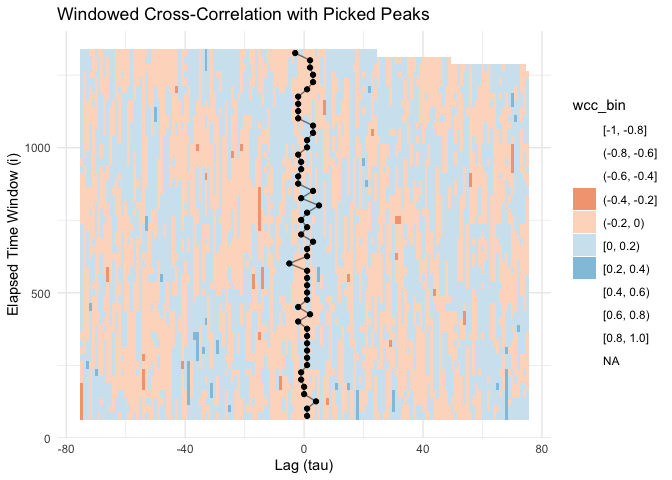

<!-- README.md is generated from README.Rmd. Please edit that file -->

# wcc

<!-- badges: start -->

<!-- badges: end -->

The goal of wcc is to …

## Installation

You can install the development version of wcc from
[GitHub](https://github.com/) with:

``` r
# install.packages("devtools")
devtools::install_github("jmgirard/wcc")
```

## Example

``` r
library(wcc)
data("sim_dyad")

# Step 1: Calculate 3D velocity for both individuals
# The v_xyz function requires time and the three spatial coordinates
sim_dyad$vel_A <- v_xyz(sim_dyad$time, sim_dyad$x_A, sim_dyad$y_A, sim_dyad$z_A)
sim_dyad$vel_B <- v_xyz(sim_dyad$time, sim_dyad$x_B, sim_dyad$y_B, sim_dyad$z_B)

# Step 2: Calculate Windowed Cross-Correlations
# We correlate the velocities using a 3-second window (150 samples)
# and evaluate lags up to +/- 1.5 seconds (75 samples)
wcc_results <- wcc(
  x = sim_dyad$vel_A,
  y = sim_dyad$vel_B,
  window_size = 150,
  lag_max = 75,
  window_increment = 25,
  lag_increment = 1,
  na.rm = TRUE
)

# Step 3: Extract the Peaks
# Find the specific lag of maximum association for each time window
# using a 5-lag local search region (L_size must be odd)
peaks <- pick_peaks(
  wcc_obj = wcc_results,
  L_size = 5,
  strict_monotonic = FALSE
)

# Step 4: Review the results
# Notice how the peak_lag smoothly shifts from positive to negative over time
head(peaks)
#>     i peak_lag   peak_value
#> 1  76        1  0.002783088
#> 2 101        1  0.018752169
#> 3 126        4  0.135470699
#> 4 151        0  0.015772604
#> 5 176        0 -0.001309840
#> 6 201       -1  0.008358272
tail(peaks)
#>       i peak_lag   peak_value
#> 46 1201        1 -0.051637341
#> 47 1226        3 -0.030065123
#> 48 1251        3  0.014502260
#> 49 1276        2  0.006311976
#> 50 1301        2  0.009551426
#> 51 1326       -3  0.075449024

# Plot the underlying correlation landscape (if plot function is exported)
plot(wcc_results)
```


