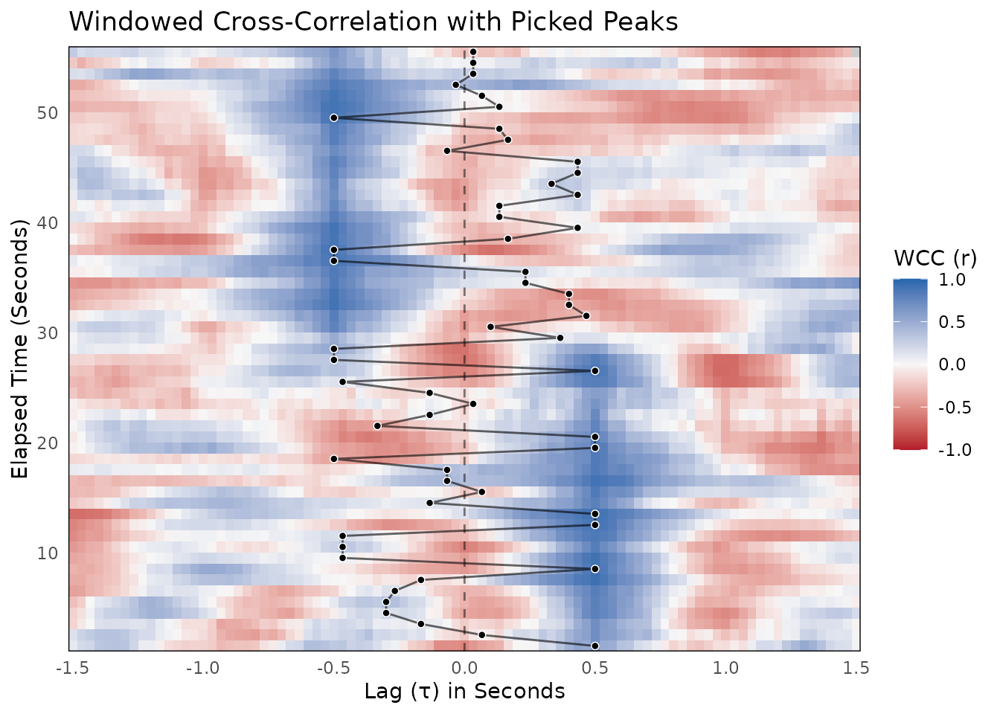

# WCC Workflow

## Analyzing Interpersonal Synchrony with Windowed Cross-Correlation

This vignette walks through a complete Windowed Cross-Correlation (WCC)
analysis using the `bsync` package. WCC is highly effective for
quantifying interpersonal synchrony because it accommodates
non-stationary relationships. Unlike global cross-correlation, WCC
captures how synchronization ebbs and flows over time.

We will cover data simulation, calculating WCC, surrogate testing for
statistical significance, peak picking, and visualization. For guidance
on selecting the appropriate window sizes and lag parameters, please see
the
[`suggest_wcc_params()`](https://jmgirard.github.io/bsync/reference/suggest_wcc_params.md)
vignette.

### 1. Simulating Realistic Dyadic Data

To demonstrate the workflow, we will simulate a realistic interaction
between two participants (Person A and Person B) captured at 30 Hz. We
will generate smooth continuous data to simulate bodily motion.

In this scenario, Person A leads the interaction by 15 frames (0.5
seconds) for the first half of the task. In the second half, the dynamic
flips and Person B leads by 15 frames.

``` r

library(bsync)
library(dplyr)
#> 
#> Attaching package: 'dplyr'
#> The following objects are masked from 'package:stats':
#> 
#>     filter, lag
#> The following objects are masked from 'package:base':
#> 
#>     intersect, setdiff, setequal, union

set.seed(2026)

# Simulation parameters
fs <- 30
n_frames <- 1800 # 60 seconds of data

# Generate a smooth base signal using a moving average on white noise
raw_noise <- rnorm(n_frames + 300)
base_signal <- stats::filter(raw_noise, rep(1/15, 15), circular = TRUE)
base_signal <- as.numeric(base_signal)

person_A <- numeric(n_frames)
person_B <- numeric(n_frames)

# Create the shifting leader-follower dynamic
for (i in 1:n_frames) {
  if (i <= n_frames / 2) {
    # First half: Person B follows Person A by 15 frames
    idx_A <- 150 + i
    idx_B <- 150 + i - 15
  } else {
    # Second half: Person A follows Person B by 15 frames
    idx_A <- 150 + i - 15
    idx_B <- 150 + i
  }

  # Add slight independent noise to mimic realistic measurement error
  person_A[i] <- base_signal[idx_A] + rnorm(1, sd = 0.1)
  person_B[i] <- base_signal[idx_B] + rnorm(1, sd = 0.1)
}

dyad_data <- data.frame(
  time = seq(0, by = 1/fs, length.out = n_frames),
  person_A = person_A,
  person_B = person_B
)
```

By adding a custom simulation here, we avoid relying on highly
simplified data provided in the package’s raw data files.

### 2. Calculating Windowed Cross-Correlation

With our data ready, we can run the primary
[`wcc()`](https://jmgirard.github.io/bsync/reference/wcc.md) function.
This function slides a window across the time series and calculates the
cross-correlation at various lags within each window.

We will use a window size of 90 frames (3 seconds) and a maximum lag of
45 frames (1.5 seconds). We will also increment the window by 30 frames
(1 second) to allow for overlap and smooth transitions.

``` r

wcc_results <- wcc(
  x = dyad_data$person_A,
  y = dyad_data$person_B,
  window_size = 90,
  lag_max = 45,
  window_increment = 30,
  lag_increment = 1
)

# View a summary of the results
summary(wcc_results)
#> 
#> ── Windowed Cross-Correlation Analysis ─────────────────────────────────────────
#> Total Windows: 55
#> Total Lags Tested: 91
#> Window Size: 90
#> Max Lag: 45
#> Overall Fisher's Z: 0.2948
#> 
#> ── Cross-Correlation Value Distribution ──
#> 
#>      0%     25%     50%     75%    100% 
#> -0.6858 -0.1998  0.0179  0.2551  0.9166
#> ! 1 missing value (NA) detected.
```

The [`wcc()`](https://jmgirard.github.io/bsync/reference/wcc.md)
function returns a list object of class `wcc_res` containing the results
data frame, the overall Fisher’s Z score, and the input settings.

### 3. Surrogate Testing for Significance

Time series data are inherently autocorrelated. Because of this
autocorrelation, high cross-correlation values can sometimes occur
purely by chance. To test if the synchronization we observed is
meaningful, we generate a null distribution using the circular shift
method.

The
[`wcc_surrogate()`](https://jmgirard.github.io/bsync/reference/wcc_surrogate.md)
function handles this by shifting one time series relative to the other,
destroying the true synchronous relationship while preserving the
autocorrelation of the individual signals.

``` r

surrogate_results <- wcc_surrogate(
  x = dyad_data$person_A,
  y = dyad_data$person_B,
  window_size = 90,
  lag_max = 45,
  window_increment = 30,
  lag_increment = 1,
  n_surrogates = 100
)

print(surrogate_results)
#> 
#> ── WCC Surrogate Analysis (Pseudo-Synchrony) ───────────────────────────────────
#> Permutations: 100
#> Observed Fisher's Z: 0.2948
#> Average Null Z: 0.2187
#> Empirical p-value: 0
#> ✔ Observed synchrony is significantly greater than chance.
```

The output gives us an empirical p-value by calculating the proportion
of surrogate Fisher’s Z scores that meet or exceed our observed Fisher’s
Z. If the p-value is significant, we can confidently assert that the
observed synchrony is greater than chance.

### 4. Peak Picking

While the heatmap is visually informative, we often want to extract the
precise lags where coordination is strongest within each time window.
The
[`pick_peaks()`](https://jmgirard.github.io/bsync/reference/pick_peaks.md)
function identifies local maximums within the WCC grid.

We specify the `L_size` argument to set the local search region.

``` r

# Extract peaks using a local search size of 5
wcc_peaks_df <- pick_peaks(wcc_results, L_size = 5)

print(wcc_peaks_df)
#> 
#> ── WCC Peak Picking Results ────────────────────────────────────────────────────
#> Total Peaks Found: 55
#> Local Search Size: 5
#> Strict Monotonic: FALSE
#> Showing the first 5 peaks:
#>    i peak_lag peak_value
#>   46       15  0.7049796
#>   76        2 -0.0561398
#>  106       -5  0.1409913
#>  136       -9  0.2241356
#>  166       -9  0.3676144
#> # ... with 50 more rows
```

This returns a `wcc_peaks` data frame containing the elapsed time
indices, the peak lags, and the corresponding correlation values.

### 5. Visualizing the Results

Finally, we can visualize the shifting synchronization landscape. The
[`plot_peaks_overlay()`](https://jmgirard.github.io/bsync/reference/plot_peaks_overlay.md)
function generates a heatmap of the correlations and plots the extracted
peaks directly on top.

By passing the `time_step` argument, the axes are automatically
converted from raw frame indices to seconds.

``` r

plot_peaks_overlay(
  wcc_obj = wcc_results,
  peaks_df = wcc_peaks_df,
  time_step = 1 / fs,
  show_zero_lag = TRUE
)
```



In the resulting plot, you should clearly see the structural shift we
built into our data. For the first 30 seconds, the peak synchrony sits
securely at a positive lag (indicating Person A leads). Right at the
30-second mark, the band of high correlation drops to a negative lag
(indicating Person B is now leading).
