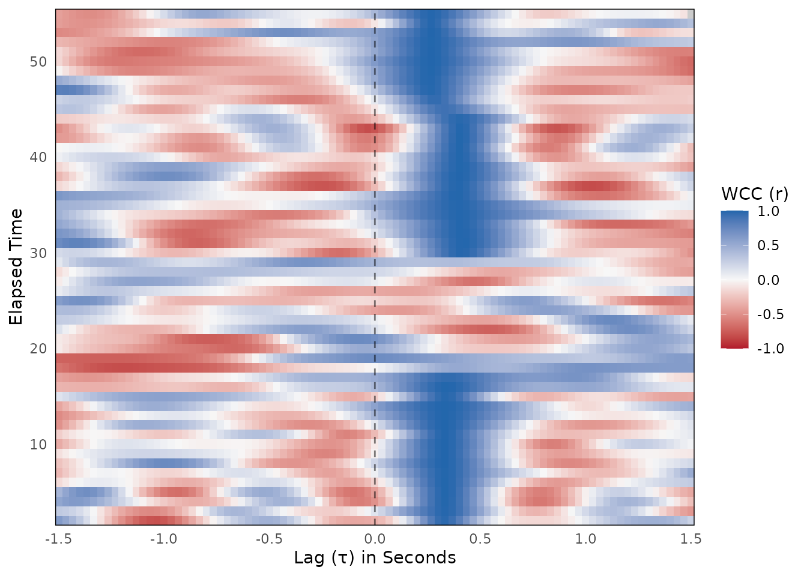
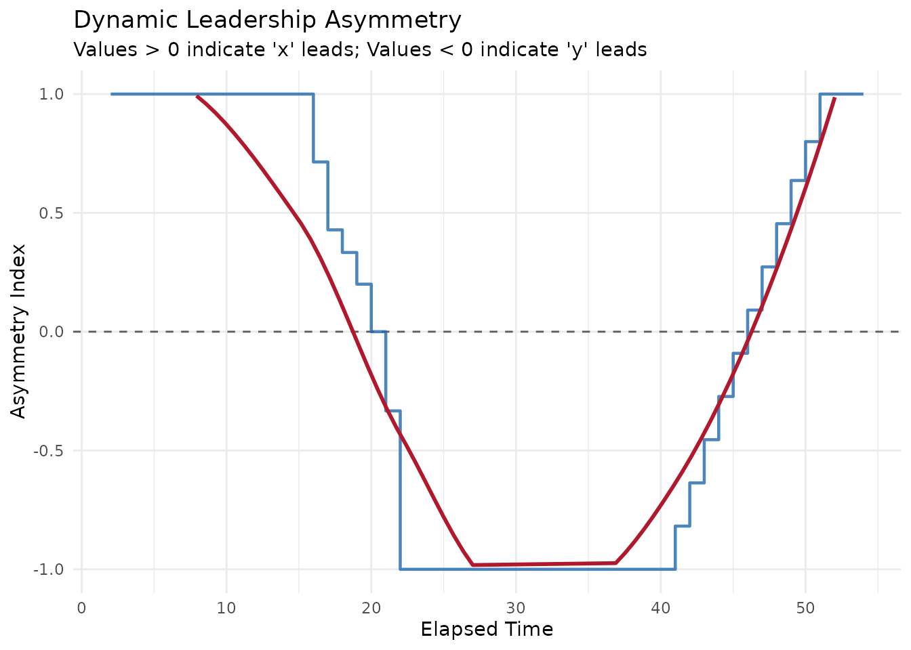

# WCC Workflow

This vignette walks through a complete Windowed Cross-Correlation (WCC)
analysis using the **bsync** package. WCC is highly effective for
quantifying interpersonal synchrony because it accommodates
non-stationary relationships. Unlike global cross-correlation, WCC
captures how synchronization ebbs and flows over time.

We will cover data simulation, calculating WCC, surrogate testing for
statistical significance, optima extraction, and quantifying leadership
dynamics using the package’s pipeline approach. For guidance on
selecting the appropriate window sizes and lag parameters, please see
the
[`suggest_wcc_params()`](https://jmgirard.github.io/bsync/reference/suggest_wcc_params.md)
vignette.

## 1. Simulating and Preparing Realistic Data

To demonstrate the workflow, we will simulate a realistic interaction
between two participants (Person A and Person B) captured at 30 Hz. We
will generate smooth continuous data to simulate bodily motion and then
add random measurement noise.

Unlike a perfectly stationary interaction, this scenario mimics natural
turn-taking and includes four distinct behavioral phases over the course
of 60 seconds:

1.  **Phase 1 (0 to 20s):** Person A leads the interaction by 10 frames
    (0.33 seconds).
2.  **Phase 2 (20 to 30s):** An uncorrelated lull where both
    participants move independently.
3.  **Phase 3 (30 to 46s):** Person B takes over and leads by 12 frames
    (0.40 seconds).
4.  **Phase 4 (46 to 60s):** Person A interjects and leads by 8 frames
    (0.26 seconds).

``` r

library(bsync)
library(dplyr)

set.seed(2026)

# Simulation parameters
fs <- 30
n_frames <- 1800 # 60 seconds of data

# 1. Generate underlying rhythms (a shared rhythm and two independent rhythms)
# We use a moving average to create smooth, human-like motion waves
time_seq <- seq(0, by = 1/fs, length.out = n_frames)
shared_base <- as.numeric(stats::filter(rnorm(n_frames + 300), rep(1/15, 15), circular = TRUE))
indep_base_A <- as.numeric(stats::filter(rnorm(n_frames + 300), rep(1/15, 15), circular = TRUE))
indep_base_B <- as.numeric(stats::filter(rnorm(n_frames + 300), rep(1/15, 15), circular = TRUE))

person_A_raw <- numeric(n_frames)
person_B_raw <- numeric(n_frames)

# 2. Piece together the dyadic interaction
for (i in 1:n_frames) {

  if (i <= 600) {
    # Phase 1 (0-20s): Person A leads by 10 frames (0.33 seconds)
    person_A_raw[i] <- shared_base[150 + i]
    person_B_raw[i] <- shared_base[150 + i - 10]

  } else if (i <= 900) {
    # Phase 2 (20-30s): Lull / No correlation
    person_A_raw[i] <- indep_base_A[150 + i]
    person_B_raw[i] <- indep_base_B[150 + i]

  } else if (i <= 1400) {
    # Phase 3 (30-46s): Person B leads by 12 frames (0.40 seconds)
    person_A_raw[i] <- shared_base[150 + i - 12]
    person_B_raw[i] <- shared_base[150 + i]

  } else {
    # Phase 4 (46-60s): Person A leads by 8 frames (0.26 seconds)
    person_A_raw[i] <- shared_base[150 + i]
    person_B_raw[i] <- shared_base[150 + i - 8]
  }
}

# 3. Create the raw data frame with added measurement noise
dyad_data_raw <- data.frame(
  time = time_seq,
  person_A_raw = person_A_raw + rnorm(n_frames, sd = 0.05),
  person_B_raw = person_B_raw + rnorm(n_frames, sd = 0.05)
)
```

### 1.1 Smoothing and Edge Trimming

Raw kinematic data almost always requires smoothing before analysis.
Here, we apply a Savitzky-Golay filter to iron out the high-frequency
measurement noise.

However, polynomial smoothing algorithms require surrounding data to
calculate an accurate average. This causes mathematical distortion at
the extreme beginning and end of the recording. We use
[`trim_edges()`](https://jmgirard.github.io/bsync/reference/trim_edges.md)
to drop these edge artifacts to ensure our analysis is built strictly on
stable data. A standard rule of thumb is to trim a length equal to your
smoothing window.

``` r

# 4. Smooth the raw data and trim the edges
dyad_data <-
  dyad_data_raw |>
  mutate(
    person_A = smooth_signal(person_A_raw, method = "sgolay", window = 15),
    person_B = smooth_signal(person_B_raw, method = "sgolay", window = 15)
  ) |>
  trim_edges(trim_length = 15)
```

## 2. Calculating Windowed Cross-Correlation

With our data ready, we can run the primary
[`wcc()`](https://jmgirard.github.io/bsync/reference/wcc.md) function.
This function slides a window across the time series and calculates the
cross-correlation at various lags within each window.

We will use a window size of 90 frames (3 seconds) and a maximum lag of
45 frames (1.5 seconds). We will also increment the window by 30 frames
(1 second) to allow for overlap and smooth transitions.

``` r

wcc_results <- wcc(
  x = dyad_data$person_A,
  y = dyad_data$person_B,
  time = dyad_data$time,
  window_size = 90,
  lag_max = 45,
  window_increment = 30,
  lag_increment = 1
)

# View a summary of the results
summary(wcc_results)
#> 
#> ── Windowed Cross-Correlation Analysis ─────────────────────────────────────────
#> Total Windows: 53
#> Total Lags Tested: 91
#> Window Size: 90
#> Max Lag: 45
#> Overall Fisher's Z: 0.4506
#> 
#> ── Cross-Correlation Value Distribution ──
#> 
#>      0%     25%     50%     75%    100% 
#> -0.8432 -0.2721  0.0168  0.3989  0.9983
```

The [`wcc()`](https://jmgirard.github.io/bsync/reference/wcc.md)
function returns a list object of class `wcc_res` containing the results
data frame, the overall Fisher’s Z score, and the input settings.

We can easily visualize these initial results using the default
[`plot()`](https://rdrr.io/r/graphics/plot.default.html) method. By
passing the `time_step` argument, the axes are automatically converted
from raw frame indices to seconds.

``` r

plot(wcc_results, time_step = 1 / fs)
```



This generates a heatmap where deep blue indicates strong positive
correlation (synchrony) and deep red indicates strong negative
correlation. You can already see a clear track of high correlation
shifting across the zero-lag line over time alongside a washed-out
period of low correlation in the middle.

## 3. Surrogate Testing for Significance

Time series data are inherently autocorrelated. Because of this, high
cross-correlation values can sometimes occur purely by chance. To test
if the synchronization we observed is meaningful, we generate a null
distribution using the circular shift method.

``` r

surrogate_results <- wcc_surrogate(
  x = dyad_data$person_A,
  y = dyad_data$person_B,
  time = dyad_data$time,
  window_size = 90,
  lag_max = 45,
  window_increment = 30,
  lag_increment = 1,
  n_surrogates = 1000
)

print(surrogate_results)
#> ── WCC Surrogate Analysis (Pseudo-Synchrony) ───────────────────────────────────
#> Permutations: 1000
#> Observed Fisher's Z: 0.4506
#> Average Null Z: 0.3158
#> Empirical p-value: < 0.001
#> ✔ Observed synchrony is significantly greater than chance.
```

The output gives us an empirical p-value by calculating the proportion
of surrogate Fisher’s Z scores that meet or exceed our observed Fisher’s
Z. Because the observed value was higher than all 1000 permutations, the
empirical p-value is reported as \< .001.

## 4. Optima Extraction

While the heatmap generated above is visually informative, we often want
to extract the precise lags where coordination is strongest within each
time window. The
[`pick_optima()`](https://jmgirard.github.io/bsync/reference/pick_optima.md)
function identifies local maximums within the WCC grid.

Because our simulation includes a programmed lull where the participants
move independently, the algorithm will naturally find weak, meaningless
“noise peaks” during that period. To prevent the tracking line from
wildly jumping around during this lull, we can pass a `threshold`
argument.

Setting `threshold = 0.55` ensures that any optimum with an absolute
correlation weaker than r = 0.55 is overwritten with `NA`.

``` r

# Extract optima using a local search size of 9 and a threshold of 0.55
wcc_optima_df <- pick_optima(wcc_results, L_size = 9, threshold = 0.55)

# View a statistical breakdown of the extracted optima
summary(wcc_optima_df)
#> 
#> ── WCC Optima Summary ──────────────────────────────────────────────────────────
#> 
#> ── Completeness ──
#> 
#> • Total time windows: 53
#> • Valid optima retained: 44 (83%)
#> • Optima dropped (NA): 9 (17%)
#> 
#> ── Lag Directionality (Leadership) ──
#> 
#> • Positive Lags (x leads y): 24 (54.5%)
#> • Negative Lags (y leads x): 19 (43.2%)
#> • Zero Lags (Simultaneous): 1 (2.3%)
#> 
#> ── Optimum Value Distribution ──
#> 
#>     0%    25%    50%    75%   100% 
#> 0.5708 0.9877 0.9936 0.9961 0.9983
```

### 4.1 Interpreting the Optima Summary

The [`summary()`](https://rdrr.io/r/base/summary.html) method provides a
concise breakdown of the behavioral dynamics. We can map these results
directly to the four phases we programmed into our simulation:

- **Completeness:** The summary shows that 17% (9 windows) of the optima
  were dropped and set to `NA`. This aligns perfectly with Phase 2 of
  our simulation, which was a 10-second uncorrelated lull. Raising our
  threshold successfully identified and removed this non-interactive
  period.
- **Lag Directionality (Leadership):** Because we supplied `person_A` as
  `x` and `person_B` as `y`, a positive lag means Person A is leading,
  and a negative lag means Person B is leading. The summary shows
  positive lags for 54.5% of the valid interaction, reflecting the times
  Person A led in Phases 1 and 4. It shows negative lags for 43.2% of
  the interaction, correctly identifying the middle section where Person
  B took over.
- **Optimum Value Distribution:** The quantiles provide a quick look at
  the strength of the coordination during the valid interactive phases.
  With the 25th percentile sitting at \\r = 0.98\\, we have absolute
  confirmation that the retained peaks represent strong, structural
  synchrony rather than random noise.

### 4.2 Tuning the Local Search Window (`L_size`)

Choosing the right `L_size` is crucial for a successful local search.
`L_size` must be an odd integer, and it defines the width of the
neighborhood (in frames) that the algorithm evaluates to confirm a local
maximum.

There is a delicate balance to strike:

- **If `L_size` is too small (e.g., 3):** The algorithm might get
  trapped by tiny noise ripples near lag zero and completely miss the
  true interactive response.
- **If `L_size` is too large (e.g., 45):** The algorithm might skip over
  the fast, immediate interactive response and lock onto a delayed,
  mathematically stronger, but theoretically irrelevant rhythm.

A good rule of thumb is to set `L_size` to capture roughly 0.1 to 0.5
seconds of data. At 30 Hz, an `L_size` between 5 and 15 frames is
usually a great starting point. Because
[`pick_optima()`](https://jmgirard.github.io/bsync/reference/pick_optima.md)
is computationally lightweight, we recommend experimenting with several
values and visually comparing the plots.

## 5. Visualizing the Results

We can visually confirm our optima extraction by overlaying the tracking
path directly onto the WCC heatmap.

``` r

plot_optima_overlay(
  surface_obj = wcc_results,
  optima_df = wcc_optima_df,
  time_step = 1 / fs,
  show_zero_lag = TRUE
)
```


In the resulting plot, the tracking line perfectly visualizes the
distinct phases of our simulated interaction:

- **0 to roughly 18 seconds:** A stable vertical line sits at a positive
  lag (~0.33s), correctly identifying Person A as the initial leader.
- **18 to 30 seconds:** There is a clean break in the tracking line.
  Because we applied a threshold, the algorithm successfully ignored the
  weak, random noise peaks during the uncorrelated lull, leaving this
  non-interactive period appropriately blank.
- **30 to 45 seconds:** The tracking line reappears on the left side of
  the zero-line at a negative lag (~ -0.40s), perfectly capturing Phase
  3 where Person B takes the lead.
- **46 seconds onward:** The tracking line jumps back to the right side
  of the zero-line as Person A reclaims the lead for the final phase of
  the interaction.

## 6. Quantifying Leadership Dynamics

Visualizing the optima is helpful, but researchers ultimately need a
continuous, quantifiable metric of who is driving the interaction. The
[`leadership_asymmetry()`](https://jmgirard.github.io/bsync/reference/leadership_asymmetry.md)
function converts the extracted optima into a bounded Leadership
Asymmetry Index (LAI) ranging from -1 (y entirely leads) to 1 (x
entirely leads).

Because **bsync** is designed around a consistent class structure, you
can seamlessly chain the entire analytical process together using the
native R pipe (`|>`):

``` r

# Run the complete pipeline from WCC results to LAI visualization
wcc_results |>
  pick_optima(L_size = 9, threshold = 0.55) |>
  leadership_asymmetry(epoch_size = 10, min_valid = 3) |>
  plot(smooth = TRUE)
#> `geom_smooth()` using formula = 'y ~ x'
```



By grouping the windows into local epochs (in this case, groups of 10
windows), the LAI function smooths over momentary frame-by-frame jitter
to reveal the broader structural periods of dominance.

The resulting plot tells the entire story of the interaction at a
glance. The metric starts firmly at `1.0` (Person A leading), smoothly
transitions down through zero during the uncorrelated lull, hits `-1.0`
(Person B leading) right at the 30-second mark, and finally climbs back
up to `1.0` as Person A re-enters the conversation.
