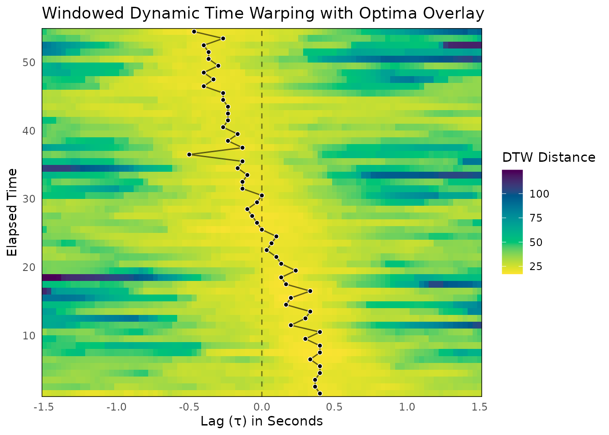
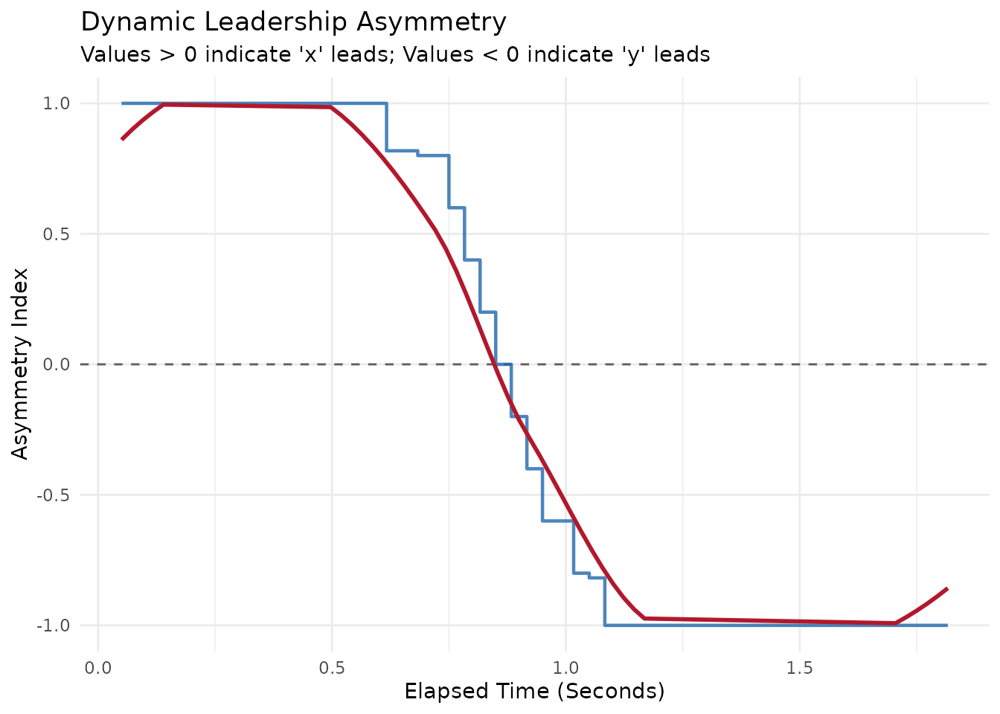

# WDTW Workflow

While Windowed Cross-Correlation (WCC) is excellent for capturing linear
relationships, it forces the data into a rigid temporal grid. If two
participants are performing the same behavior but at slightly different
speeds, standard correlation methods will fail to recognize the
synchrony.

Windowed Dynamic Time Warping (WDTW) solves this problem. It excels at
finding similarities in signals that might be distorted, stretched, or
compressed in time.

It is important to remember that WDTW calculates a distance metric
rather than a correlation. This means that lower values indicate
stronger synchronization (a smaller distance between the signals).

## 1. What is Windowed Dynamic Time Warping?

Dynamic Time Warping finds the optimal alignment between two time series
by non-linearly warping the time axis. It creates a local cost matrix
and finds the lowest-cost path to map the points of Person A’s signal
onto the points of Person B’s signal, allowing for one-to-many and
many-to-one matches.

By calculating DTW over a rolling window, **bsync** allows you to track
how this shape-matching distance changes over the course of an
interaction.

### 1.1 Assumptions and Applicability

**When is WDTW useful?**

- **Variable Execution Speeds:** It is ideal for complex behavioral
  mimicry where participants perform matching actions at different paces
  (e.g., one person smiles quickly while the other produces a slow,
  drawn-out smile).
- **Shape over Timing:** When the structural pattern of the behavior is
  more theoretically important than the rigid frame-by-frame timing.

**When should you avoid WDTW?**

- **When Exact Duration Matters:** Because WDTW achieves alignment by
  stretching and compressing the time axis, it inherently distorts the
  temporal reality of the interaction. If you need to know exactly how
  many milliseconds separate two behaviors, WCC is a safer choice.
- **Highly Noisy Data:** WDTW is highly sensitive to extreme outliers
  and high-frequency noise. If data is not properly smoothed, the
  algorithm may aggressively warp the time axis to match random noise
  spikes rather than the underlying behavioral signal.
- **Strict Causal Inference:** Like WCC, WDTW measures alignment and
  similarity. It cannot statistically prove that one signal is causing
  the other, which requires predictive methods like Windowed Granger
  Causality.

## 2. Simulating Realistic Dyadic Data

To demonstrate the workflow, we will simulate an interaction between two
participants (Person A and Person B) captured at 30 Hz. We will generate
smooth continuous data to simulate bodily motion.

In this scenario, Person A leads the interaction by 15 frames (0.5
seconds) at the start. Over the course of the 60 seconds, the dynamic
smoothly transitions until Person B leads by 15 frames at the end.

``` r

library(bsync)

set.seed(2026)

# Simulation parameters
fs <- 30
n_frames <- 1800 # 60 seconds of data

# Generate a smooth base signal using a 30-frame moving average.
raw_noise <- rnorm(n_frames + 300)
base_signal <- stats::filter(raw_noise, rep(1/30, 30), circular = TRUE)
base_signal <- as.numeric(base_signal)

person_A <- numeric(n_frames)
person_B <- numeric(n_frames)

# Continuous lag shift: Person A leads by 15 frames, smoothly transitioning to B leading
lag_shifts <- round(seq(15, -15, length.out = n_frames))

for (i in 1:n_frames) {
  idx_A <- 150 + i
  idx_B <- 150 + i - lag_shifts[i]

  # Add slight independent noise to mimic realistic measurement error
  person_A[i] <- base_signal[idx_A] + rnorm(1, sd = 0.05)
  person_B[i] <- base_signal[idx_B] + rnorm(1, sd = 0.05)
}

dyad_data <- data.frame(
  time = seq(0, by = 1/fs, length.out = n_frames),
  person_A = person_A,
  person_B = person_B
)
```

## 3. Calculating Windowed Dynamic Time Warping

With our data ready, we can run the primary
[`wdtw()`](https://jmgirard.github.io/bsync/reference/wdtw.md) function.
This function slides a window across the time series and calculates the
DTW alignment distance at various lags within each window.

We strongly recommend setting `scale_method` to either `"global"` or
`"local"`. DTW distances are highly sensitive to the scale of the input
variables. Standardizing the data ensures that the resulting cost matrix
is driven by the structural shape of the behaviors rather than arbitrary
measurement units. For highly non-stationary data where baselines drift
significantly over time, consider using `"local"`.

The `distance_metric` defaults to `"L2"` (squared Euclidean distance),
which is standard for DTW, but `"L1"` (Manhattan) is also available.

``` r

wdtw_results <- wdtw(
  x = dyad_data$person_A,
  y = dyad_data$person_B,
  time = dyad_data$time,
  window_size = 90,
  lag_max = 45,
  window_increment = 30,
  lag_increment = 1,
  scale_method = "global",
  distance_metric = "L2"
)

# View a summary of the results
print(wdtw_results)
#> 
#> ── Windowed Dynamic Time Warping Analysis ──────────────────────────────────────
#> Total Windows: 54
#> Total Lags Tested: 91
#> Window Size: 90
#> Max Lag: 45
#> Scale Method: global
#> Distance Metric: L2
#> Overall Mean Distance: 27.1612
```

The [`wdtw()`](https://jmgirard.github.io/bsync/reference/wdtw.md)
function returns a list object of class `wdtw_res` containing the
results data frame, the overall mean distance, and the input settings.

## 4. Optima Extraction (Finding the Minima)

While the full distance matrix is informative, we often want to extract
the precise lags where the alignment is optimal within each time window.
For correlation (WCC), optimal alignment means the highest value
(peaks). For distance metrics (WDTW), optimal alignment means the lowest
cost (valleys).

The
[`pick_optima()`](https://jmgirard.github.io/bsync/reference/pick_optima.md)
function handles this seamlessly. Because we are providing a `wdtw_res`
object, the function automatically infers that it should execute a
global search across the window to find the absolute minimum distance
(`search_method = "global"` and `find_min = TRUE`).

``` r

# Extract optimal alignment lags (valleys) using the default global search
wdtw_optima_df <- pick_optima(wdtw_results)

summary(wdtw_optima_df)
#> 
#> ── WDTW Optima Summary ─────────────────────────────────────────────────────────
#> 
#> ── Completeness ──
#> 
#> • Total time windows: 54
#> • Valid optima retained: 54 (100%)
#> • Optima dropped (NA): 0 (0%)
#> 
#> ── Lag Directionality (Leadership) ──
#> 
#> • Positive Lags (x leads y): 24 (44.4%)
#> • Negative Lags (y leads x): 29 (53.7%)
#> • Zero Lags (Simultaneous): 1 (1.9%)
#> 
#> ── Optimum Value Distribution ──
#> 
#>     0%    25%    50%    75%   100% 
#> 4.1667 5.1867 5.5318 5.8954 6.8954
```

This returns a `wdtw_optima` data frame containing the elapsed time
indices, the optimal lags, and the corresponding DTW distance values.
The console output confirms that the search mode was successfully set to
“Valleys (Minima)” using a “global” search method.

## 5. Visualizing the Results

We can visualize the shifting synchronization landscape. The
[`plot_optima_overlay()`](https://jmgirard.github.io/bsync/reference/plot_optima_overlay.md)
function detects that it is working with a `wdtw_res` object and
automatically applies a sequential viridis color palette to map the
distances, while plotting the global minima points on top.

By passing the `time_step` argument, the axes are automatically
converted from raw frame indices to seconds.

``` r

plot_optima_overlay(
  surface_obj = wdtw_results,
  optima_df = wdtw_optima_df,
  time_step = 1 / fs,
  show_zero_lag = TRUE
)
```



In the resulting plot, lighter colors represent smaller distances
(stronger synchrony). You will see a diagonal track corresponding to the
simulated shift in the dyad’s interaction. The overlaid points map
exactly to the lowest alignment costs, smoothly tracing the transition
from Person A leading to Person B leading.

## 6. Quantifying Leadership Dynamics

Visualizing the optima helps to understand the general pattern, but
researchers ultimately need a continuous, quantifiable metric of who is
driving the interaction. The
[`leadership_asymmetry()`](https://jmgirard.github.io/bsync/reference/leadership_asymmetry.md)
function converts the extracted optima into a bounded Leadership
Asymmetry Index (LAI) ranging from -1 (y entirely leads) to 1 (x
entirely leads).

Because **bsync** is designed around a consistent class structure, you
can seamlessly chain the entire analytical process together using the
native R pipe (`|>`):

``` r

# Run the complete pipeline from results to LAI visualization
wdtw_results |>
  pick_optima() |>
  leadership_asymmetry(epoch_size = 10, min_valid = 3) |>
  plot(smooth = TRUE)
#> `geom_smooth()` using formula = 'y ~ x'
```



By grouping the windows into local epochs, the LAI function smooths over
momentary frame-by-frame jitter to reveal the broader structural periods
of dominance. The resulting plot makes the continuous transition of
leadership from Person A to Person B perfectly clear.
