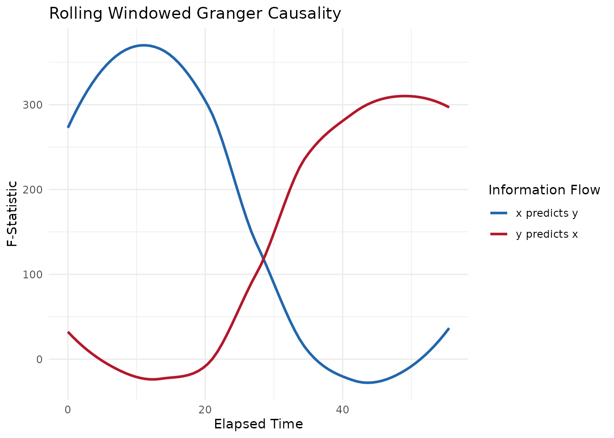
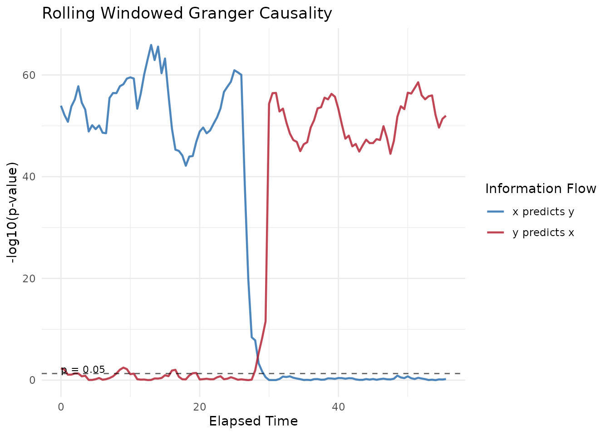

# Windowed Granger Causality Workflow

This vignette walks through a complete Windowed Granger Causality (WGC)
analysis using the **bsync** package.

While Windowed Cross-Correlation (WCC) and Windowed Dynamic Time Warping
(WDTW) are excellent for quantifying *how much* two participants are
synchronized, they do not inherently prove *who is driving* the
interaction. Granger Causality is a statistical hypothesis test that
determines whether the past values of one time series are useful for
predicting the future values of another. By applying this test over a
rolling window, we can map how leader–follower dynamics shift
dynamically during an interaction.

## 1. What is Granger Causality?

Granger Causality relies on linear autoregressive (AR) models. The core
logic is simple:

1.  We try to predict Person B’s current movement using *only* Person
    B’s past movement (the restricted model).
2.  We try to predict Person B’s current movement using *both* Person
    B’s past movement *and* Person A’s past movement (the unrestricted
    model).

If adding Person A’s history significantly reduces the prediction error
compared to using Person B’s history alone, we say that **A
Granger-causes B**. The **bsync** package automatically calculates this
in both directions (A predicting B, and B predicting A) for every time
window.

### 1.1 Assumptions and Applicability

**When is WGC useful?**

- **Continuous, High-Frequency Data:** It is ideal for data like head
  pose, facial action units, or physiological arousal where behavior at
  one millisecond is highly dependent on the previous millisecond.
- **Finding the “Driver”:** When you already know two signals are
  related, but you need statistical proof of the direction of
  information flow.

**When should you avoid WGC?**

- **Categorical Data:** Granger Causality uses Ordinary Least Squares
  (OLS) regression, which requires continuous numeric data. It will fail
  or produce invalid results on binary or categorical states.
- **Unknown Lags:** Unlike WCC, Granger Causality does not search a
  massive grid to find the optimal delay. You must specify how many lags
  back the model should look. If the reaction time between participants
  is highly variable or unknown, WCC is a better exploratory tool.
- **Highly Non-Linear Systems:** Because the underlying AR models are
  linear, WGC might miss complex non-linear coordination unless the
  sliding windows are kept brief enough that the local interaction
  approximates a linear relationship.

## 2. Simulating Realistic Dyadic Data

To demonstrate the workflow, we will simulate an interaction captured at
30 Hz.

In this scenario, we simulate a conversation with a clear shift in
conversational dominance.

1.  **Phase 1 (0 to 30s):** Person A drives the interaction. Person B
    mirrors Person A with a short reaction delay of 3 frames (100
    milliseconds).
2.  **Phase 2 (30 to 60s):** Person B takes over the conversation.
    Person A begins mirroring Person B with a 3-frame delay.

``` r

library(bsync)
library(dplyr)

set.seed(2026)

fs <- 30
n_frames <- 1800 # 60 seconds of data

# Generate smooth baseline movements using a moving average
base_A <- as.numeric(stats::filter(rnorm(n_frames + 50), rep(1/10, 10), circular = TRUE))[1:n_frames]
base_B <- as.numeric(stats::filter(rnorm(n_frames + 50), rep(1/10, 10), circular = TRUE))[1:n_frames]

person_A <- numeric(n_frames)
person_B <- numeric(n_frames)

for (i in 1:n_frames) {
  if (i <= 900) {
    # Phase 1: A leads B
    person_A[i] <- base_A[i]
    # B follows A with a lag of 3 frames and slight measurement noise
    person_B[i] <- ifelse(i > 3, person_A[i - 3] + rnorm(1, sd = 0.05), rnorm(1, sd = 0.05))
  } else {
    # Phase 2: B leads A
    person_B[i] <- base_B[i]
    # A follows B with a lag of 3 frames and slight measurement noise
    person_A[i] <- ifelse(i > 903, person_B[i - 3] + rnorm(1, sd = 0.05), rnorm(1, sd = 0.05))
  }
}

dyad_data <- data.frame(
  time = seq(0, by = 1/fs, length.out = n_frames),
  person_A = person_A,
  person_B = person_B
)
```

## 3. Calculating Windowed Granger Causality

We will use the
[`wgranger()`](https://jmgirard.github.io/bsync/reference/wgranger.md)
function to analyze the interaction.

We set the `ar_order` to 3, meaning the model will use the past 3 frames
of history to predict the current frame. We will use a `window_size` of
120 frames (4 seconds) to ensure the regression model has plenty of
degrees of freedom to establish statistical significance. We will slide
the window forward by 15 frames (0.5 seconds) at a time.

``` r

wgc_results <- wgranger(
  x = dyad_data$person_A,
  y = dyad_data$person_B,
  time = dyad_data$time,
  window_size = 120,
  ar_order = 3,
  window_increment = 15
)

# View a statistical breakdown of the analysis
summary(wgc_results)
#> 
#> ── Windowed Granger Causality Analysis ─────────────────────────────────────────
#> Total Windows: 112
#> Window Size: 120
#> AR Order (Lags): 3
#> 
#> ── Significance Summary (p < 0.05) ──
#> 
#> • 'x' significantly predicts 'y' in 59 windows (52.7%)
#> • 'y' significantly predicts 'x' in 68 windows (60.7%)
```

The summary output provides an immediate, high-level view of the
interaction dynamics. Because we programmed the simulation to have a
perfectly even split of leadership, the summary will show that Person A
significantly predicted Person B roughly 50% of the time, and Person B
significantly predicted Person A for the other 50%.

## 4. Visualizing the Results

While the summary is helpful, visualizing the rolling statistics shows
us *when* these shifts occurred.

The [`plot()`](https://rdrr.io/r/graphics/plot.default.html) method for
WGC objects allows you to visualize either the magnitude of the
predictive power (`metric = "F"`) or the statistical significance
(`metric = "p"`).

### 4.1 Visualizing Effect Size (F-Statistic)

Plotting the F-statistic provides a clear view of the strength of the
predictive relationship.

``` r

# Plot the F-Statistics with loess smoothing applied
plot(wgc_results, metric = "F", smooth = TRUE)
#> `geom_smooth()` using formula = 'y ~ x'
```



In this plot, the blue line represents Person A driving Person B, and
the red line represents Person B driving Person A. You can see a massive
effect size for Person A during the first 30 seconds of the interaction,
which drops to near zero as Person B takes over for the final 30
seconds.

### 4.2 Visualizing Statistical Significance (p-values)

When you plot the p-values, the function automatically converts them
using a `-log10` transformation. This makes the plot much easier to read
because highly significant values spike upwards rather than vanishing
toward zero. The plot also automatically includes a dashed reference
line at \\p = 0.05\\.

``` r

# Plot the raw significance values
plot(wgc_results, metric = "p", smooth = FALSE)
```



This visualization confirms our simulation perfectly.

- From 0 to 30 seconds, the blue line (`x predicts y`) sits high above
  the \\p = 0.05\\ threshold, proving that Person A is significantly
  driving the interaction.
- Right at the 30-second mark, the blue line crashes below the
  significance threshold, and the red line (`y predicts x`) spikes
  upwards, mathematically proving the shift in conversational dominance.

By applying Windowed Granger Causality, we have successfully extracted a
rigorous, directional statistical inference from continuous behavioral
data.
